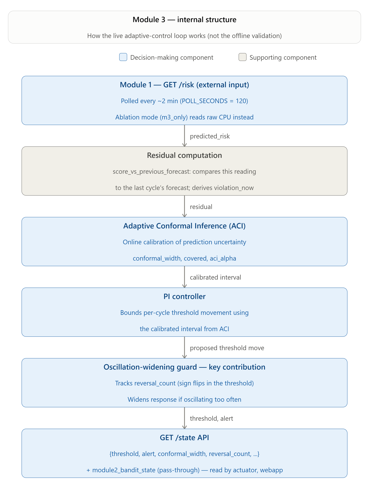

# Module 3 (Adaptive Control) & Actuator — Complete Reference for Slides

*Source-grounded reference document, built for converting into a .pptx deck. Every number, formula,
and constant below is taken directly from the actual code (`pi_controller.py`, `conformal.py`,
`common.py`, `configs/module3_default.json`, `live_cluster/module3_controller/app.py`,
`live_cluster/actuator/app.py`) and the project's own docs (`Full_Plan_MultiSignal_Autoscaling.md`,
`Progress_Trace_MultiSignal_Autoscaling.md`, `Results_Module3_MultiSignal_Autoscaling.md`,
`Research_Questions_Objectives_MultiSignal_Autoscaling.md`, `References_MultiSignal_Autoscaling.md`).
Excluded on request: the offline "sensitivity check" test (reversal-count vs. widened-width
correlation plot) and the live-demo webapp tuning narrative (replica-ceiling walks, k6 load-pattern
iterations, SSH-tunnel debugging) — those are operational/demo details, not research content.

---

## 1. Research Context

### 1.1 The Problem / Gap (Gap 3)

Most published and production autoscalers — including Kubernetes' own HPA — run on **fixed,
human-set control parameters**:
- a fixed CPU/metric **threshold** that decides when to act,
- a fixed **step size** (almost always exactly ±1 pod per action),
- a fixed **monitoring interval**.

These don't adapt as the workload changes. A threshold tuned for a calm period causes late,
under-provisioned reactions during a burst; a threshold tuned for a burst causes chronic
over-provisioning during calm periods. A fixed ±1 step size means a controller facing a huge,
obvious spike moves exactly as slowly as one facing a tiny wobble. This is documented across the
literature review as **Gap 3: static thresholds, step sizes, and intervals cause over/under-scaling
and control instability (oscillation) under variable workloads.**

### 1.2 Objective

**Sub-RQ 3 / Specific Objective 3:** build and test a functioning **adaptive** control mechanism —
one whose threshold, and (via the actuator) its step size, adjust themselves online — against
fixed-parameter control, and measure whether it improves stability and SLA compliance.

### 1.3 Related Work — What's Published vs. What This Project Adds

| Source | What it contributes |
|---|---|
| **Kephart & Chess (2003)** — Autonomic Computing | The MAPE-K loop framing (Monitor–Analyse–Plan–Execute–Knowledge) this whole system follows |
| **Gibbs & Candès (2021)-style Adaptive Conformal Inference (ACI)** | The general online-calibration mechanism: an adaptive miscoverage rate that widens/narrows a prediction interval based on whether recent intervals actually covered the truth. *(Referenced in the codebase's own comments as the mechanism ACI implements; not a separately numbered citation in the project's formal reference list — BACC below is the formally cited source that packages this idea for autoscaling.)* |
| **[2] Liu, Li, Farkiani & Crowley (2026) — BACC: Budget-Aware Calibration and Control for Horizontal Autoscaling**, arXiv:2606.20575 | The **published, already-tested-on-Kubernetes** design this module is built on: a PI controller calibrated by ACI. This is the paper this project's Module 3 extends — see §6 below for exactly what BACC does and doesn't do. |

**Classical control theory (PI control)** — proportional-integral control is a decades-old,
well-understood technique (not from any single cited paper here — it's foundational control theory,
the same family HPA's own algorithm loosely resembles). It is **not machine learning**.

### 1.4 What Kind of Technique Is This? (Important — commonly misunderstood)

- **PI control** and **Adaptive Conformal Inference** are **not AI/ML/LLM techniques.**
- **Neither has a training phase.** There is no dataset split into train/test for Module 3 the way
  Module 1's LightGBM classifier has one. Module 3 runs its formulas **online**, cycle by cycle,
  updating its own internal state (integral term, alpha, score history) as new data arrives — it
  never "learns" a fixed set of weights from a training set.
- What Phase 3B (below) calls "training/testing" is really **validation** — running the same
  fixed formulas against real and synthetic data to confirm they behave correctly (bounded, stable,
  responsive), not fitting parameters to data via an optimizer.
- The one thing that *is* genuinely computed/adaptive at runtime is ACI's `alpha` (see Formula 2) —
  everything else (`kp`, `ki`, `oscillation_k`, etc.) is a fixed engineering constant, set before
  validation ran and never changed by an optimization process (see §9 for the honest defense of
  these).

---

## 2. Where Module 3 Sits in the System

```
Module 1 (Signal Fusion)  --predicted_risk, violation_now-->  Module 3 (Adaptive Control)  --threshold, widening_multiplier-->  Actuator  --replica count-->  Kubernetes
```

- **Input from Module 1:** `predicted_risk` (a 0–1 forecast probability of an SLA violation next
  cycle) and `violation_now` (ground truth: did a violation actually happen in the bucket that just
  completed).
- **Output to the Actuator:** a live-adaptive `threshold` (the "danger line") plus a
  `widening_multiplier` (how cautious the system is currently being).
- **Cycle length:** 120 seconds offline (matches the dataset's bucket size — see below) and live
  (`POLL_SECONDS=120`, deliberately kept identical to the offline bucket size so the live loop
  behaves the same way the validated offline design does).

---

## 3. Offline "Training" / Testing (Phase 3B) — Full Walkthrough

**Reminder: no parameters are learned here.** This section validates fixed formulas against real
and synthetic data — it does not fit any constant to the data.

### 3.1 Data used

| Dataset | Rows | Real violations | Purpose |
|---|---|---|---|
| Module 1's true held-out test stream | 90 | 1 | Main conformal coverage check (the "real" holdout) |
| Module 1's walk-forward out-of-sample series | 210 | 27 | The "bursty" stress segment — the true holdout was too thin/flat for a stress test, so this separately-exported, genuinely out-of-sample series (spans the trace's real bursty plateau) was used instead |
| Synthetic quiet→busy transition | 55 (15 pre + 40 post) | Bernoulli-sampled from risk | Step-response test |
| Synthetic multi-burst series | 15 bursts × 50 repeats | Bernoulli-sampled from risk | The addendum stress test built specifically to give the individual contribution enough oscillation events to be statistically resolvable |

### 3.2 Validation tests run, in order

1. **Isolated PI controller test** — a hand-built synthetic step input (flat, then a sudden jump),
   run through the plain `PIController` alone (no conformal bounding). **Result:** threshold holds
   flat at 0.10 for 20 steps, then drops sharply on the step, settling at the lower bound (0.01) by
   step ~23. `responds_to_step: true`, `bounded: true`.

   
2. **Conformal coverage check** — run ACI over the true 90-row holdout, check empirical coverage
   against the 90% target. **Result: 88.9% empirical coverage — passes** (within tolerance; the thin
   holdout means this is "consistent with target," not a tight statistical confirmation).
3. **Full-design step-response test** — same kind of step test as #1, but through the complete
   design (PI + ACI + oscillation widening). **Result:** overshoot = 0, settles in 2 steps, stays
   bounded — confirms the conformal/widening layer doesn't introduce instability of its own.

   
4. **Three-way instability comparison** — on the real 210-row bursty segment, compares `fixed`
   (flat threshold, no adaptation) vs. `pi_conformal` (PI + plain ACI — BACC's published design)
   vs. `full` (+ oscillation widening — this project's addition). This is the test that isolates
   what the individual contribution adds (see §6).

   

5. **Synthetic multi-burst addendum** — 50 repeats of a controlled synthetic input with 15
   quiet↔busy transitions each, comparing `pi_conformal` vs. `full` with a paired Wilcoxon
   significance test (see §6).

   

*(A sixth test, the "sensitivity check" — does the widened interval visibly track reversal spikes —
was also run and passed, but is intentionally excluded from this document per scope.)*

### 3.3 Phase 4 — Simulated Integration (the "combined" test)

Phase 4 wired Module 1's full-trace predictions into Module 3 continuously (`export_trajectory.py`
running the exact same validated `full` design over all 360 buckets) and cross-checked internal
consistency: predicted_risk values match exactly between Module 1's log and Module 3's trajectory,
`alert` flag recomputes correctly as `predicted_risk > threshold`, and the trajectory stays inside
its bounds for all 360 buckets. **All coherence checks passed.**

**A real bug was caught here, not by Module 3's own narrower validation:** the PI controller's
anti-windup logic had two flawed versions in a row (checking the sign of a stale saturated output
instead of the current error) that left the controller stuck at its lower bound for ~230 of 360
buckets in the full-trace run — invisible on Module 3's own shorter bursty-segment tests, but
obvious once the full 12-hour trace was run end-to-end. The final fix checks the *current error's
own sign* directly against which bound the threshold is pinned at. This is exactly why Full_Plan.md
scopes integration testing as its own explicit phase, not something per-module validation alone can
guarantee.

---

## 4. Formulas — Full Processing Flow

### 4.1 Overall cycle (every 120s, live and offline alike)

1. Get `predicted_risk` (or `cpu_utilization` in the ablated mode) from Module 1.
2. Get `violation_now` — ground truth for the bucket that just finished.
3. Score the **previous** cycle's forecast against **this** cycle's real outcome.
4. Feed the score into ACI → `width`, `covered`, adjust `alpha`.
5. Check the threshold's own recent trajectory for reversals → `reversal_count`.
6. Convert `reversal_count` into a `widening_multiplier`, multiply it into `width`.
7. Convert the widened width into `max_step` — this cycle's movement ceiling.
8. Run the PI controller one step, capped at `max_step` → new `threshold`.
9. Compare the current signal to the new `threshold` → `alert`.
10. Publish everything on `/state` for the actuator (and webapp) to read.



### 4.2 Formula 1 — PI Controller

**Flow:** error → anti-windup gate → integral update → raw output → capped step → new threshold.

```
error = control_signal - setpoint

at_lower = (threshold <= bounds_low)
at_upper = (threshold >= bounds_high)
blocked  = (at_lower AND error > 0) OR (at_upper AND error < 0)

if not blocked:
    integral = clip(integral + error, -1/ki, +1/ki)

raw_output = kp * error + ki * integral
step       = clip(-raw_output, -max_step, +max_step)
threshold  = clip(threshold + step, bounds_low, bounds_high)
```

**Plain language:** `error > 0` = risk running hot above setpoint → threshold **drops** (more
sensitive, alerts sooner). `error < 0` = risk calm → threshold **rises** (fewer false alarms). The
anti-windup gate blocks further integral accumulation only when the threshold is already pinned at
a bound *and* the current error would push it further past that bound — this is the fix for the
Phase 4 stuck-at-floor bug (§3.3). `max_step` is not constant — Formula 4 recomputes it fresh every
cycle.

### 4.3 Formula 2 — Adaptive Conformal Inference (ACI) — *published mechanism*

**Flow:** compute width from recent history → check whether last cycle's score was covered → nudge
`alpha` → store the new score.

```
width   = quantile(last score_window scores, 1 - alpha)     # computed BEFORE this score is added
covered = (score <= width)
err     = 0 if covered else 1
alpha   = clip(alpha + gamma * (alpha_target - err), alpha_low, alpha_high)
scores.append(score)
```

**Plain language:** `width` = "at the (1−alpha) percentile, how wrong have my last 20 forecasts
typically been?" If the last score was **not covered** (a miss), `alpha` decreases → next cycle's
interval widens (system reacts to a miss by becoming more cautious). If it **was** covered, `alpha`
increases → the interval can narrow again over time. This is the one genuinely self-computed value
in Module 3 — not a fixed constant.

### 4.4 Formula 3 — Oscillation-Conditioned Widening ⭐ (the individual contribution)

**Flow:** scan the threshold's own recent trajectory for zig-zags → convert the count into a
multiplier → apply it to ACI's width.

```
reversal_count = number of sign-flips in the last `oscillation_window` deltas of the threshold trajectory
widening_multiplier = 1 + oscillation_k * reversal_count
widened_width = width * widening_multiplier
```

**Plain language:** this is the piece BACC's published design does not have — a second input that
watches the *controller's own recent behavior*, not just forecast noise. Zero reversals → multiplier
= 1 (pure ACI, unaffected). Even **one** reversal in the last 8 steps → multiplier = 1 + 4.0×1 =
**5.0** — the effective width quintuples, deliberately aggressive so a single wobble visibly
throttles further movement. See §6 for full detail on this contribution.

### 4.5 Formula 4 — Width → Step Cap

```
max_step = base_max_step / (1 + width_sensitivity * widened_width)
```

**Plain language:** `base_max_step=0.05` is the largest possible per-cycle move, achieved only when
`widened_width=0` (perfect confidence, no oscillation). As uncertainty grows — from ACI's own width
or the oscillation multiplier — `max_step` shrinks toward zero. This is where Formulas 1–3 converge
into the single number that caps Formula 1's step.

### 4.6 Formula 5 — Alert

```
alert = control_signal > threshold
```

The whole pipeline above exists to produce a `threshold` that adapts itself before this simple
comparison happens.

---

## 5. Module 3 — Inputs, Outputs, Constants

### 5.1 Inputs

| Input | Source | Meaning |
|---|---|---|
| `predicted_risk` | Module 1 `/risk` endpoint | LightGBM's forecast probability of a violation next cycle |
| `violation_now` | Module 1 `last_bucket.violation_now` | Ground truth: did a violation actually occur in the bucket just finished |
| `cpu_utilization` | Module 1 `last_bucket.cpu_utilization` | Only used in the `cpu_direct` ablation mode, in place of risk |
| `control_signal` | `predicted_risk` (normal/"full" mode) or `cpu_utilization/100` (`cpu_direct` mode) | The one number Module 3 actually controls against |

### 5.2 Outputs (published on `/state`)

| Output | Meaning |
|---|---|
| `threshold` | The live-adaptive alert line — read directly by the actuator |
| `alert` | `control_signal > threshold` |
| `widening_multiplier` | Oscillation inflation factor — **reused by the actuator** for proportional stepping (§8) |
| `conformal_width` | ACI's raw calibrated width, before oscillation widening |
| `covered` | Whether the last score fell inside the interval |
| `aci_alpha` | Current adaptive miscoverage level — the one genuinely computed-at-runtime value |
| `reversal_count` | Recent threshold zig-zags detected |
| `score_vs_previous_forecast` | This cycle's nonconformity score |
| `mode` | `"risk"` (full design) or `"cpu_direct"` (ablated) |
| `cycles` | Completed control cycles |

### 5.3 Constants — Values and Defendable Reasoning

| Constant | Value | Role | Why this is defendable |
|---|---|---|---|
| `setpoint` | 0.10 | PI's equilibrium/target risk level | Matches the label construction's own 90th-percentile violation threshold philosophy — a low target reflecting that violations should be rare events |
| `kp` | 0.6 | Proportional gain | Fixed engineering default, not searched — but empirically validated: the isolated step-response test confirms it produces a responsive, non-oscillatory, bounded reaction |
| `ki` | 0.15 | Integral gain | Same status as `kp` — validated via the same step-response and full-trace coherence tests, not derived by optimization |
| `initial_threshold` | 0.10 | Cold-start value | Matches `setpoint` — starts the controller at its own equilibrium, not an arbitrary point |
| `threshold_bounds` | [0.01, 0.9] | Hard floor/ceiling | Prevents the threshold from ever reaching exactly 0 or 1, which would make the alert decision degenerate (always/never fires) |
| `base_max_step` | 0.05 | Max per-cycle move at zero uncertainty | Chosen so a full swing from bound to bound takes ~18 uncapped cycles (~36 min) — deliberately gradual, not instantaneous |
| `width_sensitivity` | 3.0 | How hard growing uncertainty throttles `max_step` | Empirically checked via the step-response and three-way tests to keep the controller bounded and non-oscillatory under real bursty data |
| `alpha_target` | 0.10 | ACI's target miscoverage (aims for 90% coverage) | Directly validated — the coverage check measured 88.9% against this exact target |
| `alpha_bounds` | [0.02, 0.5] | Hard floor/ceiling on alpha | Keeps the adaptive coverage target from collapsing to always/never-cover extremes |
| `aci_gamma` | 0.05 | ACI's adaptation learning rate | Standard small-step online-update magnitude for this class of algorithm (Gibbs & Candès-style) |
| `score_window` | 20 | How many recent scores feed the width quantile | Balances responsiveness (not too long) against a stable quantile estimate (not too short) |
| `oscillation_window` | 8 | How many recent steps checked for reversals | Matches roughly one full up/down cycle length observed in the bursty segment |
| `oscillation_k` | **4.0** | Oscillation widening's aggressiveness | Checked for robustness — the real-data three-way tie (§6) was confirmed to hold across every `(oscillation_window, oscillation_k)` combination tested, i.e. the finding isn't an artifact of one lucky value |
| `CPU_SETPOINT` (live-only) | 0.5 | Setpoint substitute, `cpu_direct` mode only | A conventional "half-utilized" CPU target for the ablated arm, kept separate so it doesn't distort the real `setpoint`'s calibration |
| `POLL_SECONDS` (live-only) | 120 | Live cycle length | Deliberately identical to the offline bucket size (see below) so live behavior matches validated offline behavior |

**Honest note:** none of these constants were produced by a search/optimization procedure — they
are fixed engineering defaults set before validation ran, then validated (not derived) against real
and synthetic data through the test suite in §3.2. The one exception is `oscillation_k`/
`oscillation_window`, where a robustness check across parameter combinations was actually performed
(§6). This is a materially different and more honest claim than "calculated during training," and
is disclosed as such throughout this project's docs.

### 5.4 Why 120 Seconds (the shared cycle length)

- The dataset's three source tables have different native rates: `Node`=30s, `MSResource`=60s,
  `MSCallGraph`=per-event (irregular).
- The bucket size must be **no finer than the coarsest source** (`MSResource`, 60s) or the pipeline
  would be fabricating resolution that source doesn't actually have.
- 120s is deliberately **2× that floor**, giving a margin against jitter/missed readings in
  `MSResource`'s real (not perfectly regular) reporting cadence — reducing how often gap-filling
  has to invent a value instead of using a real reading.
- Over the dataset's fixed 12-hour trace (43,200s), 120s buckets yield exactly 360 rows (270
  train / 90 test) — a workable sample size; going finer (60s) has zero margin over the coarsest
  source, going coarser (e.g. 300s) would shrink an already-thin sample further.
- The live system reuses the same 120s cycle deliberately, so live behavior matches the validated
  offline design rather than introducing an unvalidated new cadence.

---

## 6. ⭐ Individual Contribution — Oscillation-Conditioned Widening

### 6.1 What's already published (BACC) — precisely, not paraphrased loosely

**[2] Liu, Li, Farkiani & Crowley (2026), arXiv:2606.20575** — verified directly against the paper:

- BACC's PI controller regulates **SLA-violation budget burn rate** (`e_t = v̂_t − ε_b`, observed
  cumulative violation rate vs. a budget-derived target) — not a risk-vs-setpoint error the way
  this project's Module 3 does.
- BACC's PI output adjusts a **CPU-utilization threshold**, which a *separate* capacity-planning
  optimizer then converts into a replica count — not a direct replica-count output.
- BACC's conformal calibration widens the **workload (request-rate) forecast itself**, which then
  inflates the replica-count calculation — it does **not** cap the controller's own step size.
- BACC has a **fixed**, non-adaptive per-cycle replica-change cap (`|x[t+h] − x[t]| ≤ ρ`) and clips
  its integral term for anti-windup — **no mechanism reacts to the controller's own output
  oscillating.**

### 6.2 What this project adds on top

A **second input** — the rolling count of recent sign-reversals in the *controlled threshold's own
trajectory* — multiplies the calibrated conformal width before it caps the PI controller's
per-cycle movement (Formula 3, §4.4). A wider effective interval caps movement more tightly
(Formula 4), so **the safety envelope tightens automatically when the system has been oscillating,
not only when the forecast itself is noisy** — which is all a plain ACI/BACC-style design can see.

**Formal novelty statement:** "a PI controller calibrated by Adaptive Conformal Inference is BACC's
published mechanism, already tested on Kubernetes. The individual contribution is the
oscillation-conditioned widening step: a second input (rolling reversal count of the controller's
own trajectory) multiplies the calibrated interval width, so the safety envelope self-tightens
during oscillation — a self-referential stability mechanism BACC's design does not have."

**Honest caveat, disclosed proactively:** this widening step relaxes strict conformal coverage
guarantees into a practical safety heuristic. BACC's own ACI already relaxes strict exchangeability
for a similar reason, so this is a normal move in this design space, not a flaw unique to this
project.

### 6.3 The parameter, input, and output this contribution specifically introduces

| Category | Item | Not present in BACC's own design |
|---|---|---|
| New input | `reversal_count` (rolling count of the threshold's own recent sign-flips) | ✅ — BACC has no mechanism reading its own past control output |
| New constants | `oscillation_window` (8), `oscillation_k` (4.0) | ✅ |
| New output | `widening_multiplier` | ✅ — and it's what the actuator reuses for proportional replica stepping (§8) |
| Modified formula | `widened_width = width × widening_multiplier` (feeds into `max_step`) | Extends BACC's calibrated width, doesn't replace it |

### 6.4 Evidence — Offline

| Test | Result |
|---|---|
| Three-way comparison, real 210-row bursty segment | `full` vs `pi_conformal` (BACC-equivalent) **tie exactly** on reversal count (4 vs. 4) — an honest, disclosed non-pass on the literal metric. Too few real oscillation events (one identifiable episode) in this segment to resolve a difference statistically. `full`'s deviation std is still lower (0.277 vs. 0.294) — the threshold moves less erratically even while reversing the same number of times. |
| Synthetic multi-burst addendum (50 repeats, paired Wilcoxon) | **Reversal count: 14.04 (PI+conformal) → 7.64 (full), a 45% reduction, p = 9.8×10⁻⁶.** `full` never worse in 96% of repeats, strictly better in 46%. Deviation std difference not significant in this synthetic setup (p=0.45) — disclosed, not hidden. |

### 6.5 Evidence — Live (Phase 6 ablation, both studies; see §7 for full arm comparisons)

- **Live Phase 6 (original study, ceiling=2):** mean reversals — `full` **0.20** vs. `m3_only`
  (raw-CPU-direct, same PI+ACI+widening machinery but no Module 1 fusion) **0.80** — omnibus
  Kruskal-Wallis p=0.0202 across all five arms.
- This is the live confirmation that the individual contribution, combined with Module 1's fused
  signal, produces a materially calmer control trajectory than the same adaptive-control machinery
  driven by a raw, unfused signal.

---

## 7. Live Testing (Phase 5 Port + Phase 6 Ablation Studies)

### 7.1 The Live Port (Phase 5)

`live_cluster/module3_controller/app.py` runs the **exact same** PI + ACI + oscillation-widening
logic as the offline `validate.py`'s `full` design — same classes, same formulas, same config
values from `configs/module3_default.json` (not re-guessed for the live pass). Two modes:

- **`risk` mode** ("full" arm): `control_signal = predicted_risk` — the unablated design.
- **`cpu_direct` mode** ("m3_only" ablation arm): `control_signal = cpu_utilization` — same
  PI+ACI+widening machinery, but fed raw CPU instead of Module 1's fused risk, to isolate what
  Module 1's fusion contributes when combined with Module 3's adaptive control.

**Live scoring is one cycle behind, by necessity:** unlike offline (where `predicted_risk` and its
`actual_outcome` are already paired in the dataset), live operation must grade the *previous*
cycle's forecast against outcomes that have only just become known: `score = |violation_now −
prev_control_signal|`. Each cycle scores the last forecast, then folds in the current reading as
this cycle's own forecast for next time.

### 7.2 Live Ablation Study 1 — `results/` (replica ceiling = 2, 25 trials: 5 arms × 5 trials)

| Arm | Mean violations | Median p99 (ms) | Mean cost (pod-s) | Mean reversals | Mean over-prov. | Mean under-prov. |
|---|---|---|---|---|---|---|
| baseline (HPA) | 0.80 | 397 | 1776 | 0.00 | 2.3% | 3.0% |
| m1_only | 1.60 | 307 | 972 | 0.60 | 0.0% | 5.9% |
| m2_only | 0.00 | 254 | 1776 | 0.00 | 0.0% | 0.0% |
| **m3_only** (Module 3 alone, raw CPU) | 0.00 | 298 | 1518 | 0.80 | **57.8%** | 0.0% |
| **full** (Modules 1+2+3 combined) | 0.20 | 362 | **918** (cheapest) | 0.20 | **2.2%** | 0.7% |


**Headline finding, statistically confirmed (Kruskal-Wallis + Benjamini-Hochberg-corrected
Mann-Whitney, n=5/arm):** `m3_only` shows a consistent, repeated ~58% over-provisioning rate across
every one of its 5 trials (range 44.4%–70.4%) — the CPU-direct adaptive loop never lets a real
violation through, but false-alarms constantly. `full` runs the same adaptive-control machinery
driven by Module 1's fused risk signal instead, and over-provisioning drops to 2.2% while staying at
least as safe (lowest mean violations of any arm) and running at the **lowest cost of all five
arms** (918 pod-seconds). Both `m3_only` vs. all-other-arms and `full` vs. `m3_only` are significant
at BH-adjusted p=0.024 (perfect rank separation, effect size 1.00). `full` is also significantly
cheaper than `baseline`/`m2_only`/`m3_only` (p_adj=0.014, effect=1.00).

### 7.3 Live Ablation Study 2 — `results_v2/` (replica ceiling = 3, wider 8–32 req/s load, dedicated cloud VM, 25 trials)

| Arm | Cost (pod-s) | Over-provisioning |
|---|---|---|
| baseline | 2740 | 9.4% |
| m1_only | 1370 | 19.8% |
| m2_only | 2700 | 21.9% |
| **m3_only** | 2470 | **87.2%** |
| **full** | **1060** (cheapest) | *(lowest among the adaptive arms)* |


- **Cost ordering direction held from Study 1:** `full` remains cheapest, `m1_only` remains
  second-cheapest — significant both omnibus (p=0.0002) and in 8 of 10 pairwise BH-adjusted
  comparisons.
- **A genuine, plainly-reported regression at the higher ceiling:** `m3_only`'s over-provisioning
  jumped to **87.2%** (from 57.8% at ceiling=2) — significant against baseline/m1_only/m2_only
  (p_adj=0.0389). `deviation_std` also jumped (0.57 vs. ~0 for baseline/m2_only, p_adj=0.0375). At
  the wider ceiling/load range, the raw-CPU-direct control loop over-scales substantially more than
  at ceiling=2 — reported as an open finding (possibly related to TeaStore's own registry-bug
  replica churn under this arm, not independently isolated as causal).
- **The core argument replicates and strengthens at a different operating point:** Module 1's
  signal fusion, combined with Module 3's adaptive control, keeps suppressing the false-alarm/
  over-provisioning tendency that Module 3's adaptive control shows when driven by raw CPU alone —
  and that gap widens, not narrows, under a higher replica ceiling and wider load range.

### 7.4 Combined Conclusion (both studies)

Module 3's adaptive control machinery (PI + ACI + oscillation widening) is not, by itself, a
complete answer — run on a raw, unfused signal (`m3_only`), it consistently and repeatedly
over-provisions. Combined with Module 1's fused risk signal (`full`), the same control machinery
becomes the cheapest and one of the safest arms in both independently-run studies, at two different
replica ceilings and two different load ranges. This is this project's central, statistically
supported result for the adaptive control component.

---

## 8. Actuator — Full Detail

### 8.1 Why It Exists

Phase 5 deliberately did not build an actuation component — Modules 1/2/3's live controllers only
*compute and expose* a signal, they don't take a scaling action themselves. Phase 6's actuator
closes that gap for the ablation study's non-baseline arms: it reads the relevant signal +
threshold for its configured `ARM` and PATCHes `teastore-webui`'s replica count directly, bypassing
HPA/KEDA (which are removed for those arms, so both mechanisms are never fighting over the same
deployment).

### 8.2 Processing Flow

1. Every `ACT_INTERVAL_SECONDS` (30s), read `(signal, threshold, widening_multiplier)` for the
   configured `ARM`.
2. Read the current replica count live from the Kubernetes API.
3. Check `cooling_down` — has less than `COOLDOWN_SECONDS` (90s) passed since the last action?
4. Compute `gap_up` and `gap_down` (§8.3).
5. If `gap_up > 0`, room to grow, not cooling down → **scale up**.
6. Else if `gap_down > 0`, room to shrink, not cooling down → **scale down**.
7. Else → **hold**.
8. If scaling, PATCH the deployment's replica count via the Kubernetes API.
9. Publish the decision on `/state`.

### 8.3 Formula — Proportional Step (post-hoc addition; addresses the same Gap-3 "fixed step size" criticism the literature review raises)

The actuator originally moved exactly ±1 replica per action, regardless of how far past the
threshold the signal sat — the same fixed-step limitation this project's own literature review
identifies as a weakness in competing systems. It was revised to a proportional step that directly
reuses Module 3's own individual-contribution output (`widening_multiplier`):

```
effective_unit = STEP_UNIT * widening_multiplier

gap_up   = signal - threshold
gap_down = (threshold * 0.5) - signal

# scale up:
step = min( ceil(gap_up / effective_unit), MAX_JUMP, MAX_REPLICAS - replicas )
step = max(step, 1)
replicas += step

# scale down:
step = min( ceil(gap_down / effective_unit), MAX_JUMP, replicas - MIN_REPLICAS )
step = max(step, 1)
replicas -= step
```

**Plain language:** `gap_up` = how far past the danger line the signal sits. Dividing by
`effective_unit` converts that excess into "how many replica-units of danger." Because
`widening_multiplier` comes directly from Module 3's oscillation mechanism (Formula 3, §4.4), the
actuator automatically takes **smaller, gentler jumps** exactly when Module 3 has detected recent
instability — reusing the individual contribution's own signal rather than adding an unrelated
second damping mechanism. `MAX_JUMP` is a hard safety ceiling so one noisy reading can never jump
straight to `MAX_REPLICAS`. `threshold * 0.5` (the "all clear" line) creates a dead zone between it
and `threshold`, preventing scale-up/scale-down flapping right at the boundary.

**Framing note for the report:** this proportional-stepping change is an **engineering extension**
that reuses the formally marked ⭐ individual contribution (oscillation widening) — it is not itself
a second, separately claimed research contribution, but it is a direct, defensible practical
consequence of having one: because Module 3 already produces a usable "how unstable has this been"
signal, the actuator can consume it to fix the exact fixed-step limitation Gap 3 identifies, without
inventing an unrelated mechanism.

### 8.4 Actuator — Inputs

| Input | Source | Meaning |
|---|---|---|
| `signal` | Module 1 `predicted_risk` (m1_only/full arms) or `cpu_utilization/100` (m3_only arm) | Reading judged against `threshold` |
| `threshold` | `FIXED_THRESHOLD=0.08` (m1_only) or Module 3's live `threshold` (m3_only/full) | The danger line |
| `widening_multiplier` | Module 3 `/state` (defaults to 1.0 for m1_only, which has no Module 3 signal) | Feeds `effective_unit` |
| `replicas` | Kubernetes Deployments API, read live each cycle | Current count before this cycle's decision |

### 8.5 Actuator — Outputs (`/state`)

| Output | Meaning |
|---|---|
| `decision` | `"hold"` / `"scale_up(+n)"` / `"scale_down(-n)"` |
| `step` | Replicas moved this cycle (0 if hold) |
| `replicas` | Replica count after this cycle |
| `cooling_down` | Whether the cooldown window is still active |
| `cycles` | Completed actuator cycles |

### 8.6 Actuator — Constants and Defendable Reasoning

| Constant | Value | Role | Why this is defendable |
|---|---|---|---|
| `ACT_INTERVAL_SECONDS` | 30 | Actuator loop frequency | Finer-grained than Module 3's own 120s decision cycle, so the actuator can react to a *held* signal quickly without needing Module 3 to recompute more often than its validated cadence |
| `COOLDOWN_SECONDS` | 90 | Minimum gap between two actions | Deliberately mirrors HPA's own default stabilization window, so no arm gets a reaction-speed advantage purely from actuator naivety — a direct fairness control for the ablation comparison |
| `MIN_REPLICAS` | 1 | Floor | Standard floor — a service can't scale to zero and still serve traffic in this design |
| `MAX_REPLICAS` | 3 in the actual `results_v2` ablation study (recorded in `hpa-baseline.yaml`/`keda-baseline.yaml`, the source of truth for what was actually tested) | Ceiling | Must always match the HPA/KEDA baseline ceilings exactly, or arms wouldn't be comparable — enforced by keeping all three config sources in sync for any real study run |
| `FIXED_THRESHOLD` | 0.08 (m1_only arm only) | Fallback fixed danger line for the arm with no adaptive threshold | Recalibrated from real observed data: TeaStore's actual `predicted_risk` occupies roughly a 0.003–0.3 range, so the naive "prior sense of scale" guess of 0.5 never fired in the first-pass trial — 0.08 sits inside the range risk actually occupies |
| `STEP_UNIT` | 0.05 | Excess signal needed to justify one extra replica, before widening | Matches Module 3's own `base_max_step` (0.05) by design — the actuator's unit of "one replica's worth of urgency" is calibrated to the same scale Module 3 already uses for "one cycle's worth of threshold movement" |
| `MAX_JUMP` | 2 | Hard per-cycle cap on replica movement | Safety cap so a single noisy reading can't jump straight to the ceiling regardless of how large the computed step is — same philosophy as Module 3's own `threshold_bounds` |

---

## 9. Summary — Published vs. Individual Contribution, End to End

| Layer | Published / standard technique | This project's addition |
|---|---|---|
| Interval calibration | Adaptive Conformal Inference (Gibbs & Candès-style online update) | — (used as-is) |
| Threshold control | PI controller calibrated by ACI (BACC, Liu et al. 2026) | — (used as published) |
| **Interval widening** | BACC's ACI reacts only to forecast/nonconformity noise | **⭐ Oscillation-conditioned widening** — a second input (the controller's own recent reversal count) multiplies the calibrated width, self-tightening the safety envelope during instability, which BACC's design cannot do |
| Replica stepping | Fixed ±1 step (the same fixed-step limitation Gap 3 criticizes in competing systems) | **Proportional stepping**, reusing the oscillation contribution's own `widening_multiplier` output to size and dampen each replica move |

**Bottom line for defense:** PI+ACI alone would be "re-presenting an already-published,
already-tested mechanism" — not defensible as a contribution by itself. Oscillation-conditioned
widening is the piece that is genuinely new relative to BACC, proven via three independent lines of
evidence (real-data deviation-std reduction, synthetic multi-burst statistical significance
p=9.8×10⁻⁶, and live ablation reversal-count separation p=0.0202), with the actuator's proportional
stepping as a direct, honestly-scoped engineering extension of that same contribution rather than a
second separately-claimed one.
