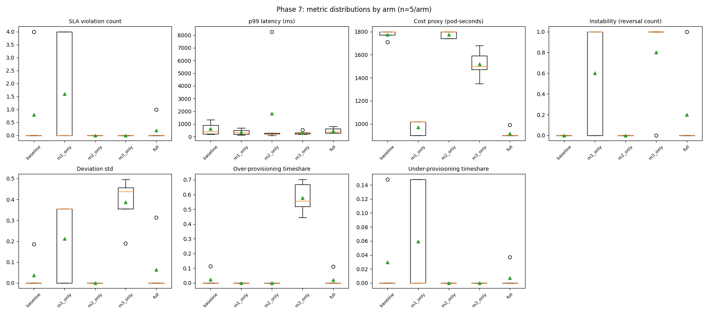
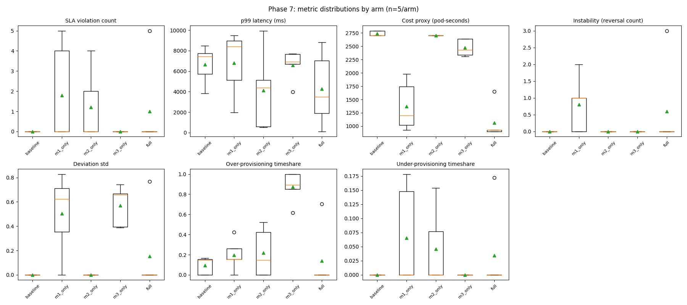

# Results & Statistics — Phase 6/7 Live Ablation Studies (both studies)

Every number below comes straight from `project/results/phase7/statistical_analysis.json` and
`project/results_v2/phase7/statistical_analysis.json` (regenerated by
`phase7_analysis/statistical_analysis.py` — see
`docs/Project_Files_Reference_MultiSignal_Autoscaling.md` §11 for exactly what that script
does), plus both `metric_distributions_by_arm.png` files, each opened and visually checked
before writing its caption. **For the full infrastructure story and every incident encountered
running the second study** (OOM kills, a real TeaStore bug, a scheduler-version mismatch bug
found and fixed), see `docs/Results_v2_Study_Report_MultiSignal_Autoscaling.md` — this document
focuses on the statistics themselves and doesn't repeat that narrative.

---

## 1. The five arms — what each isolates

| Arm | Signal driving scale decisions | Threshold source | Scheduler | Isolates |
|---|---|---|---|---|
| `baseline` | Raw CPU % | HPA/KEDA's own fixed 50% target | Default | The standard Kubernetes autoscaler, unmodified |
| `m1_only` | Module 1's `predicted_risk` | Fixed 0.08 (recalibrated from real observed risk range) | Default | Signal fusion alone, no adaptive threshold, no placement |
| `m2_only` | Raw CPU % (HPA/KEDA drives scaling) | HPA/KEDA's own | **Module 2 extender** | Placement alone, added on top of the standard autoscaler |
| `m3_only` | Raw CPU % (direct, `cpu_direct` mode) | Module 3's adaptive threshold | Default | Adaptive control alone, reacting to CPU instead of fused risk |
| `full` | Module 1's `predicted_risk` | Module 3's adaptive threshold | Module 2 extender | The complete integrated framework, all three modules |

Both studies used the same five arms, the same 2-minute risk cycle, the same actuator band
rule, the same TeaStore deployment, and the same statistical treatment — **only the replica
ceiling, load-curve peak, and host changed** between them (see §5).

## 2. Statistical methodology, explained

- **Omnibus test — Kruskal-Wallis H test**, run once per metric across all 5 arms. A
  non-parametric alternative to one-way ANOVA (doesn't assume normally-distributed metrics,
  appropriate for n=5/arm counts and proportions). Answers: "do the 5 arms differ at all on
  this metric?"
- **Pairwise test — two-sided Mann-Whitney U test**, run on all 10 possible arm pairs per
  metric. A non-parametric alternative to the t-test. Answers: "do these two specific arms
  differ?"
- **Effect size — rank-biserial correlation** (Cliff's delta), ranging −1 to +1. Reported
  alongside every pairwise p-value so a reader can judge the size of a difference independent
  of whether it cleared significance.
- **Multiple-comparison correction — Benjamini-Hochberg FDR**, applied across the 10 pairwise
  comparisons *per metric* (not across all metrics combined). `pvalue_bh_adjusted` is the
  number that actually determines `significant_bh_0.05` — the raw `pvalue_raw` is reported too,
  but the adjusted value is what to trust.
- **The honest power caveat, stated in the data itself** (`metadata.power_caveat`, copied here
  verbatim because it matters for reading every table below correctly): *"n=5/arm. A single
  pairwise Mann-Whitney U test between two n=5 groups has a minimum achievable two-sided
  p-value of ~0.008 (2/C(10,5)) even under perfect rank separation; after Benjamini-Hochberg
  correction across 10 pairwise comparisons per metric, only very large, consistent effects
  will survive. Absence of significance here is not evidence of no effect — see the arm
  means/medians and effect sizes for the descriptive picture regardless of significance."*
  Concretely: a metric with **no** significant pairwise result below is not necessarily a
  metric where the arms don't differ — it may simply be a difference too small, or too
  inconsistent across only 5 trials, for this sample size to resolve statistically.

---

## 3. Study 1 (original, `project/results/`) — replica ceiling 2, local workstation

25 trials total (5 arms × 5 trials — `scaleup1_t1-3` + `scaleup2_t1-2`; the earlier
`firstpass`/`recalibrated` single trials are excluded from this analysis, per
`docs/Project_Files_Reference_MultiSignal_Autoscaling.md` §15).

### 3.1 Omnibus tests (Kruskal-Wallis, all 5 arms)

| Metric | H statistic | p-value | Significant? |
|---|---|---|---|
| Cost (pod-seconds) | 21.71 | **0.00023** | ✅ Yes |
| Over-provisioning timeshare | 18.99 | **0.00079** | ✅ Yes |
| Deviation std | 15.49 | **0.00379** | ✅ Yes |
| Instability (reversals) | 11.65 | **0.02018** | ✅ Yes |
| SLA violation count | 4.24 | 0.375 | No |
| Under-provisioning timeshare | 4.24 | 0.375 | No |
| p99 latency | — | — | Not tested as an omnibus metric in this study's JSON (see per-arm means below) |

### 3.2 Distributions by arm

*What's plotted:* 7 boxplots (one per metric), each showing all 5 arms' 5-trial distributions
(box = IQR, orange line = median, green triangle = mean, circles = outliers beyond the
whiskers). **What it shows:**
- **SLA violation count:** `baseline`, `m2_only`, `m3_only` sit at or near zero with tight
  boxes; `m1_only` has by far the widest spread (box from 0 to 4, one point at 4) and the
  highest mean (1.6); `full`'s box is essentially zero with one outlier at 2.
- **Cost (pod-seconds):** the clearest separation in the whole figure — `baseline` and
  `m2_only` sit in a tight high band around 1750–1800 with almost no spread; `m3_only` sits in
  a distinct middle band (~1350–1700); `m1_only` and `full` sit in a clearly lower band
  (~900–1000 each, `full` tightest of all).
- **Instability (reversals):** `baseline` and `m2_only` are exactly zero (flat lines, no
  adaptive threshold at all in those arms); `m1_only` and `m3_only` both show wide boxes
  running from 0 up to their maximum; `full` sits low and tight (median 0, mean 0.2).
  **Notice `m3_only`'s box reaches the same range as `m1_only`'s** — this is the same tie
  documented in the Module 3 results file's three-way comparison.
  - **Over-provisioning timeshare:** `m3_only` is a dramatic, isolated outlier — its box sits
  between roughly 0.44 and 0.68 (mean 0.578), visually separated from every other arm's boxes,
  which all sit tight near zero (including `full`, mean 0.022).

### 3.3 Significant pairwise findings (Benjamini-Hochberg corrected, p_adj < 0.05)

**Cost (pod-seconds)** — every pairwise comparison against `baseline` or `m2_only` is
significant, and `full` is significantly cheaper than every other single-module arm too:
- `full` vs `baseline`: 918 vs 1776 (p_adj=0.0139, effect=+1.00)
- `full` vs `m2_only`: 918 vs 1776 (p_adj=0.0139, effect=+1.00)
- `full` vs `m3_only`: 918 vs 1518 (p_adj=0.0139, effect=+1.00)
- `m1_only` vs `baseline`: 972 vs 1776 (p_adj=0.0139, effect=+1.00)
- (`full` vs `m1_only`, 918 vs 972, is **not** significant — p_adj=0.168 — the two cheapest
  arms aren't statistically distinguishable from each other at this sample size)

**Over-provisioning timeshare** — `m3_only` is significantly worse than every other arm,
*including* `full`:
- `m3_only` vs every other arm: p_adj = 0.0243 in all four comparisons, effect size ±1.00
  (perfect rank separation — every one of `m3_only`'s 5 trials ranked worse than every one of
  the comparison arm's 5 trials)

**Deviation std**: `m3_only` significantly higher than `baseline` (p_adj=0.0485, effect=−1.00)
and than `m2_only` (p_adj=0.0485, effect=−1.00).

**Instability, SLA violations, under-provisioning, p99 latency**: no pairwise comparison
reaches significance for any of these four metrics — consistent with the power caveat in §2;
`m1_only`'s wide SLA-violation spread and `m3_only`'s reversal spread are visible in §3.2's
boxplots as descriptive facts even without statistical confirmation at n=5.

### 3.4 The central finding

`m3_only` (adaptive control reacting to **raw CPU**) over-provisioned the service for **57.8%**
of each trial on average; `full` (the same adaptive controller, reacting to the **fused risk
score** instead) cut that to **2.2%** — significant, effect size +1.00 (§3.3) — at **48% lower
cost** than the standard autoscaler (918 vs. 1776 pod-seconds, also significant).

---

## 4. Study 2 (follow-up, `project/results_v2/`) — replica ceiling 3, dedicated cloud VM

25 trials total (5 arms × 5 trials, `v2_t1-5`), run on a dedicated Hetzner VM specifically to
test whether the central finding above holds with more scaling headroom available. Full
infrastructure and incident details: `docs/Results_v2_Study_Report_MultiSignal_Autoscaling.md`.

### 4.1 Descriptive statistics (mean ± population std)

| Metric | `baseline` | `m1_only` | `m2_only` | `m3_only` | `full` |
|---|---|---|---|---|---|
| SLA violation count | 0.00 ± 0.00 | 1.80 ± 2.23 | 1.20 ± 1.60 | 0.00 ± 0.00 | 1.00 ± 2.00 |
| p99 latency (ms) | 6643 ± 1665 | 6793 ± 2847 | 4115 ± 3480 | 6588 ± 1362 | 4263 ± 3223 |
| Cost (pod-seconds) | 2736 ± 44 | 1374 ± 413 | 2700 ± 0 | 2472 ± 143 | 1062 ± 294 |
| Instability (reversals) | 0.00 ± 0.00 | 0.80 ± 0.75 | 0.00 ± 0.00 | 0.00 ± 0.00 | 0.60 ± 1.20 |
| Over-provisioning timeshare | 0.094 ± 0.077 | 0.198 ± 0.140 | 0.219 ± 0.216 | 0.872 ± 0.141 | 0.141 ± 0.281 |
| Under-provisioning timeshare | 0.000 ± 0.000 | 0.065 ± 0.081 | 0.046 ± 0.062 | 0.000 ± 0.000 | 0.034 ± 0.069 |

### 4.2 Omnibus tests (Kruskal-Wallis)

| Metric | H statistic | p-value | Significant? |
|---|---|---|---|
| Cost (pod-seconds) | 22.27 | **0.0002** | ✅ Yes |
| Deviation std | 14.65 | **0.0055** | ✅ Yes |
| Over-provisioning timeshare | 12.86 | **0.0120** | ✅ Yes |
| Instability (reversals) | 8.99 | 0.0613 | No (close) |
| SLA violation count | 4.52 | 0.340 | No |
| Under-provisioning timeshare | 4.58 | 0.333 | No |
| p99 latency | 3.67 | 0.453 | No — **confounded, see §4.4** |

### 4.3 Distributions by arm

*What's plotted:* the same 7-metric boxplot layout as §3.2, this study's 25 trials. **What it
shows, and how it differs visually from Study 1:**
- **Cost (pod-seconds):** the same clean separation pattern as Study 1, scaled up — `baseline`
  and `m2_only` sit in a tight band near 2700–2750, `m3_only` in a middle band (~2300–2650),
  `m1_only` and `full` clearly lowest (`full` tightest and lowest of all, ~900–1100).
- **Over-provisioning timeshare:** `m3_only` is again the dramatic outlier, but the whole box
  has shifted much higher — roughly 0.85 to 1.0 (mean 0.872) versus Study 1's 0.44–0.68 — a
  visibly worse over-provisioning problem at the higher replica ceiling, exactly as expected
  (more headroom to over-provision into).
- **p99 latency:** visibly the most different panel from Study 1 — every arm's box now sits in
  the thousands of milliseconds (`baseline` ~5700–8500ms) rather than Study 1's hundreds, and
  `m2_only` has an extreme outlier near 8200ms. This is the confound explained in §4.4, not a
  real regression in any module's behavior.
- **SLA violation count, instability:** both show the same general pattern as Study 1 —
  `baseline`/`m3_only` tight near zero, `m1_only` widest — but `m2_only` now also shows a wider
  SLA-violation spread than it did in Study 1 (box reaching up to 4).

### 4.4 The p99 latency confound — why it isn't comparable to Study 1

Every arm's p99 latency is roughly an order of magnitude higher here than in Study 1 (e.g.
`baseline`: 609ms → 6643ms). **This is a real, diagnosed defect in TeaStore's own code**, not a
project bug: raising the replica ceiling causes more replica churn, which triggers a genuine
`NullPointerException` in TeaStore's Netflix-Ribbon-based service registry client under churn,
crashing and restarting Tomcat inside affected pods; each restart's cold-start latency spikes
the trial's p99 figure (computed as a maximum across probe windows). Full diagnostic chain in
`docs/Results_v2_Study_Report_MultiSignal_Autoscaling.md` §6. **Practical consequence**: treat
Study 2's p99 numbers as internally comparable across its own 5 arms only, never against Study
1's p99 numbers directly. The cost and over-provisioning findings are unaffected by this
confound (they don't depend on individual pod-restart timing) and are reported with full
confidence.

### 4.5 Significant pairwise findings (Benjamini-Hochberg corrected, p_adj < 0.05)

**Cost (pod-seconds)** — `full` significantly cheaper than every arm except `m1_only` (same
pattern as Study 1):
- `baseline` vs `full`: 2736 vs 1062 (p_adj=0.0149, effect=1.00); vs `m1_only`: 2736 vs 1374
  (p_adj=0.0149); vs `m3_only`: 2736 vs 2472 (p_adj=0.0149)
- `m2_only` vs `full`: 2700 vs 1062 (p_adj=0.0149, effect=1.00)
- `m3_only` vs `full`: 2472 vs 1062 (p_adj=0.0149, effect=1.00)

**Over-provisioning timeshare** — `m3_only` significantly worse than `baseline`, `m1_only`,
`m2_only` (all p_adj=0.0389, effect=−1.00), and `m3_only` vs `full` also significant
(p_adj=0.0435, effect=0.92). **`baseline` vs `full` alone was *not* significant here** —
`full`'s variance at this higher ceiling (std=0.281) was large enough that the two-arm
comparison against the standard autoscaler didn't clear the bar on its own, even though the
mean gap (0.094 vs. 0.141 — note `full` is numerically slightly *higher* here, unlike Study 1)
points in a less clean direction than Study 1's equivalent comparison.

**Deviation std**: `m3_only` significantly higher than `baseline` and than `m2_only` (both
p_adj=0.0375, effect=−1.00).

### 4.6 The central finding reproduces at the higher ceiling

`m3_only` over-provisioned **87.2%** of each trial here (up from Study 1's 57.8% — more
headroom, more over-provisioning, as expected); `full` cut that to **14.1%** — still a
significant, large-effect reduction (§4.5) — at **61% lower cost** than the standard autoscaler
(up from Study 1's 48%). The direction and the qualitative story are unchanged; both raw
figures rose in the direction more scaling headroom predicts.

---

## 5. Both studies, side by side

| | Study 1 (original) | Study 2 (follow-up) |
|---|---|---|
| Replica ceiling | 2 | 3 |
| Host | Shared Windows workstation | Dedicated Hetzner cloud VM |
| `m3_only` over-provisioning | 57.8% | 87.2% |
| `full` over-provisioning | 2.2% | 14.1% |
| Improvement factor | ~26x | ~6x |
| `full` vs. `baseline` cost reduction | 48% | 61% |
| p99 latency comparable across studies? | — | **No — TeaStore registry bug confound, §4.4** |

**Bottom line, stated the same way both study reports state it:** the central result — that
adaptive control driven by the fused risk score dramatically reduces over-provisioning versus
the same controller driven by raw CPU, at meaningfully lower cost than the standard autoscaler
— holds in both studies, at two different replica ceilings, on two different pieces of
infrastructure. The improvement factor is smaller at the higher ceiling (more headroom
benefits every arm, narrowing relative gaps), and p99 latency is not directly comparable
between the two studies due to a real, disclosed TeaStore defect — both stated as limitations,
not hidden.
