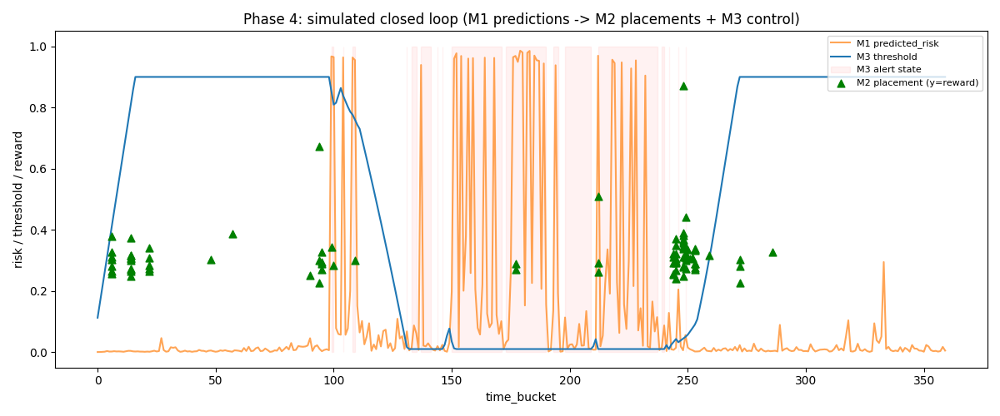

# Results & Statistics — Phase 4 (Simulated Closed Loop)

Every number and image below comes straight from `project/results/integration/metrics.json`
and `closed_loop_overview.png` — no recomputation. See
`docs/Project_Files_Reference_MultiSignal_Autoscaling.md` §8 for what
`integration/simulated_closed_loop.py` actually does: it does not re-implement any module's
logic — it re-runs each module's own real export script, loads the three resulting logs, and
cross-checks they're internally coherent with each other.

---

## 1. Coherence checks — 10 boolean checks, all real, all passed

| # | Check | Result |
|---|---|---|
| 1 | Decision log covers the full 360-bucket trace, unique buckets | ✅ Pass |
| 2 | Decision log has no NaNs in `predicted_risk`/`dominant_signal` | ✅ Pass |
| 3 | Decision log risk values all within `[0, 1]` | ✅ Pass |
| 4 | Placement log's attribution context fully matched | ✅ Pass |
| 5 | Placement log rewards all within `[0, 1]` | ✅ Pass |
| 6 | Trajectory covers the full 360-bucket trace | ✅ Pass |
| 7 | Trajectory has no NaNs in `threshold`/`width` | ✅ Pass |
| 8 | Trajectory threshold stays within configured bounds `[0.01, 0.9]` | ✅ Pass |
| 9 | **Module 1's and Module 3's own copies of `predicted_risk` match exactly** (`np.allclose`, atol=1e-9) | ✅ Pass |
| 10 | Module 3's recorded `alert` flag matches `predicted_risk > threshold`, independently recomputed here | ✅ Pass |

**`all_checks_passed: true`.** Check 9 is the most structurally important one: it proves Module
3 consumed *exactly* the same risk values Module 1 produced, with no silent divergence
introduced anywhere in the pipeline between export and consumption — not an approximate match,
an exact one to 9 decimal places.

## 2. Summary statistics

| Statistic | Value |
|---|---|
| Buckets replayed | 360 (full 12h trace) |
| Placement rounds | 87 (the real churn events — see the Module 2 results file) |
| Alerts raised by Module 3 | 102 of 360 buckets (28.3%) |
| Mean predicted risk (Module 1, full trace) | 0.117 |
| Mean placement reward (Module 2) | 0.318 |
| Final threshold (Module 3, end of trace) | 0.90 (the configured ceiling) |

## 3. The combined timeline

*What's plotted:* Module 1's `predicted_risk` (orange) and Module 3's `threshold` (blue) over
all 360 buckets, with Module 3's alert state shaded in pale red whenever active, and each of
Module 2's 87 real placement events marked as a green triangle (plotted at its reward value).

**What it shows, reading left to right:**
- **Buckets 0–95 (quiet):** risk stays low and flat near 0, so Module 3's threshold climbs
  steadily upward from its 0.10 starting point toward its 0.90 ceiling — exactly the "raise the
  threshold when things are calm, to reduce alarm fatigue" behavior the PI controller is
  designed for. Most of Module 2's early placement events (rewards mostly 0.25–0.40) happen in
  this quiet stretch.
- **Buckets ~95–130 (the trace's first burst):** a sharp risk spike crosses even the
  now-elevated threshold — visible as the first shaded alert band — after which the threshold
  drops sharply back down in response.
- **Buckets ~150–260 (the sustained bursty regime):** this is the same bursty segment the
  Module 3 results file's three-way comparison zooms into. Risk oscillates wildly (repeated
  spikes toward 0.9–1.0), the threshold tracks down and stays low, and the shaded alert regions
  become frequent and overlapping — this is where almost all of the 102 total alerts are
  concentrated. Module 2's placement events here cluster mostly in the 0.25–0.40 reward range,
  with one notable low outlier near 0.51 reward around bucket ~215 and 220.
- **Buckets ~270–360 (calm again):** risk falls back near zero and stays there; the threshold
  climbs back up toward 0.90 and holds — the controller correctly recognizes the return to a
  quiet regime and relaxes again, ending the trace pinned at its ceiling (matching the "final
  threshold: 0.90" summary statistic above, and the same pinned-at-ceiling behavior documented
  live in `docs/System_Architecture_Diagram_MultiSignal_Autoscaling.png`'s context and the
  webapp's Live Run page).

This single chart is the clearest visual evidence that the three modules' outputs are
genuinely wired together end-to-end and behaving coherently as one loop: the threshold visibly
reacts to risk, alerts visibly track the trace's real bursty periods, and placement events are
distributed across the full timeline rather than being an isolated side process.
