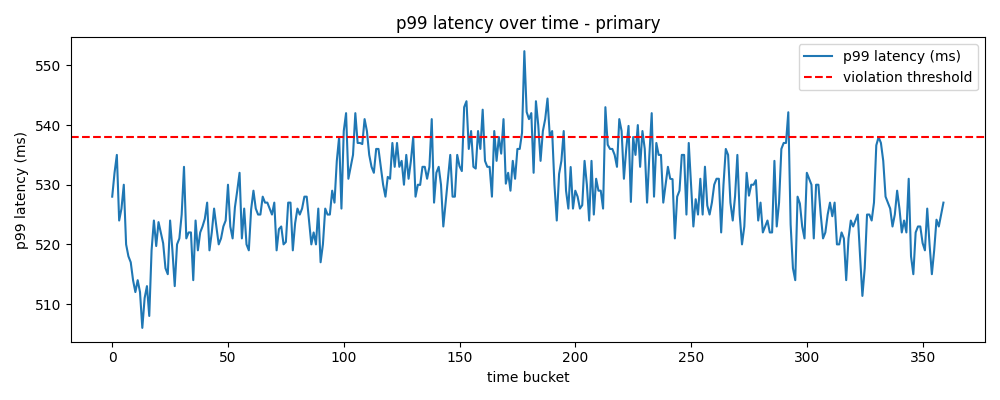
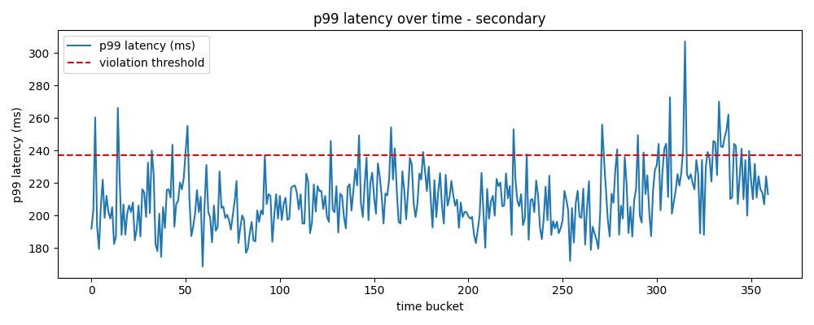
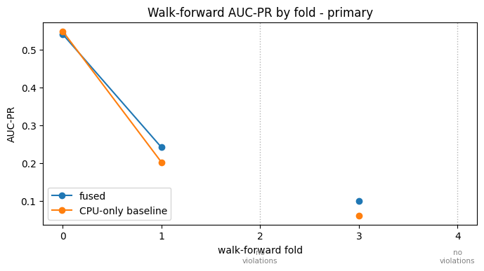
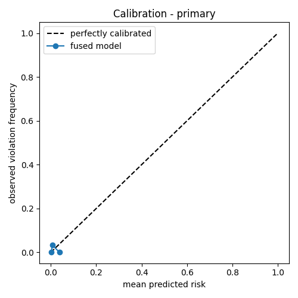
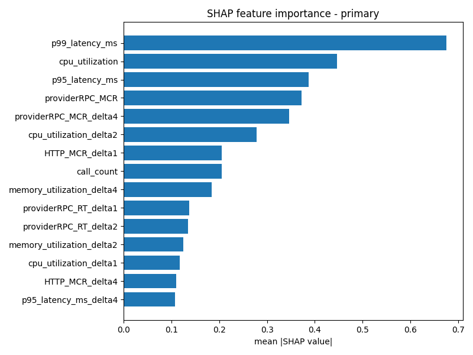

# Results & Statistics — Phase 1 (Preprocessing) and Module 1 (Signal Fusion)

Every number and image below comes straight from the committed files under `project/results/
phase1_preprocessing/` and `project/results/module1/primary/` — no recomputation, no rounding
beyond what's shown. Each plot was opened and visually checked before writing its caption, not
described from its filename alone. See `docs/Project_Files_Reference_MultiSignal_Autoscaling.md`
§4–5 for what the code that produced these actually does.

---

## 1. Phase 1 — Preprocessing: the labeled feature table

Two independent runs of `preprocessing/build_features.py build`, one per case-study service
(`primary` = Module 1's main service, `secondary` = the held-out service used only for Module
1's generalization check).

| | Primary | Secondary |
|---|---|---|
| Rows (time buckets, 120s each) | 360 (a full 12h trace) | 360 |
| Columns | 37 | 37 |
| Violation threshold (90th percentile of p99 latency) | **538.0 ms** | **237.0 ms** |
| Label mean — overall | 9.17% | 10.0% |
| Label mean — train split (first 75%, time-ordered) | 11.85% | 4.81% |
| Label mean — test split (last 25%) | 1.11% | 25.56% |
| Mean call volume/bucket | 38,805 (σ=3,089) | 13,080 (σ=3,937) |

**The train/test label-mean split is worth reading carefully, not just noting.** Because the
split is time-based (never shuffled — see `time_based_split()`), it inherits whatever the trace
actually did in each half. For `primary`, almost all violations happened in the *first* 75% of
the trace, leaving the held-out test set almost violation-free (only ~1 in 90 rows). For
`secondary`, it's the reverse — violations cluster in the *last* quarter. This single fact is
the root cause of several results below (why Module 1's held-out AUC-PR is high-variance, why
the calibration plot only has a few points near zero) — it's a property of the real trace, not
a bug in the split logic.

### 1.1 p99 latency over time — primary

*What's plotted:* the primary service's p99 latency (ms) across all 360 time buckets, with the
90th-percentile violation threshold (538.0ms) drawn as a red dashed line. **What it shows:**
latency oscillates in a fairly narrow band (roughly 505–530ms) for the first ~90 buckets, then
enters a visibly burstier regime from bucket ~95 onward with repeated spikes crossing the
threshold line (clusters around buckets 100–115, 175–180, 210–220, 290–295, and a sharp peak
near bucket 335 reaching ~552ms) — this bursty back half of the trace is exactly the segment
Module 3's real-data validation (see the Module 3 results file) also draws its 210-row "bursty
segment" from.

### 1.2 p99 latency over time — secondary

*What's plotted:* same construction, secondary service. **What it shows:** a visibly different
latency regime from the primary service — lower absolute latency (170–310ms vs. primary's
505–552ms) and a threshold (237ms) that sits inside the normal noise band rather than above it,
so violations are scattered more evenly across the trace and become markedly denser in the
final third (many crossings visible from bucket ~280 onward, several skinny spikes reaching
250–307ms) — consistent with the 25.56% test-split label mean above. This is a genuinely
different traffic pattern from `primary`, which is the point of using it as the generalization
check in §3 below.

---

## 2. Module 1 — Signal Fusion: classifier validation

Model: LightGBM binary classifier (`n_estimators=150, num_leaves=7, max_depth=4,
class_weight="balanced"`), trained on the `primary` train split, predicting
`label_next_violation` (does the *next* bucket violate the SLA).

### 2.1 Held-out comparison (single split)

| Metric | Fused model | CPU-only baseline |
|---|---|---|
| AUC-ROC | **0.652** | 0.427 |
| AUC-PR | 0.031 | 0.019 |
| Brier score (lower is better) | **0.0123** | 0.0143 |

The fused model beats the CPU-only baseline on every metric here, but the file's own recorded
note is the important context: *"Single-holdout AUC-PR is high-variance here given how few
positives the test split has; treat the walk-forward mean below as the more reliable
estimate."* With only ~1 positive in 90 held-out rows (§1's split-imbalance finding), a single
split's AUC-PR is not a number to trust in isolation — hence §2.2.

### 2.2 Walk-forward cross-validation (5-fold, expanding window)

*What's plotted:* AUC-PR per walk-forward fold, fused (blue) vs. CPU-only baseline (orange).
**Read the x-axis literally** — only 3 of the 5 folds appear (folds 2 and 4 are `null` in
`metrics.json`, meaning no positive-class examples existed in that fold's test window at all,
so AUC-PR is undefined there and the fold is skipped rather than faked). **What it shows:** both
models start high (~0.54–0.55) on fold 0, drop sharply by fold 1 (~0.20–0.24), and drop again by
the last plotted fold (~0.06–0.10) — the fused model sits at or slightly above the baseline at
every one of the 3 plotted points, though the gap narrows as both fall toward the harder,
sparser end of the trace.

| Fold | Train size | Fused AUC-ROC | Fused AUC-PR | Baseline AUC-ROC | Baseline AUC-PR |
|---|---|---|---|---|---|
| 0 | 150 | 0.588 | 0.540 | 0.597 | 0.548 |
| 1 | 192 | 0.438 | 0.242 | 0.353 | 0.203 |
| 2 | 234 | — (no positives in test window) | — | — | — |
| 3 | 276 | 0.780 | 0.100 | 0.634 | 0.063 |
| 4 | 318 | — (no positives in test window) | — | — | — |
| **Mean (3 valid folds)** | | **0.602** | **0.294** | **0.528** | **0.271** |

**Pass criterion met**: fused AUC-PR beats the CPU-only baseline in both the single holdout and
the walk-forward mean.

### 2.3 Calibration

*What's plotted:* mean predicted risk vs. observed violation frequency, binned, against the
dashed diagonal a perfectly-calibrated model would sit on. **What it shows, honestly:** every
bin sits clustered near the bottom-left corner (predicted risk under ~0.05, observed frequency
under ~0.03) — there simply aren't enough held-out positive examples (again, §1's split
imbalance: ~1 violation in 90 test rows) to populate bins across the full probability range, so
this plot can only really speak to the model's behavior in the low-risk region. It shows no
gross over-confidence there (points sit close to, if slightly above, the diagonal at the low
end), but it cannot and does not claim anything about calibration at higher predicted risk.

### 2.4 SHAP attribution — feature importance

*What's plotted:* mean absolute SHAP value per feature across all held-out test predictions,
the 15 highest-ranked features. **What it shows:** `p99_latency_ms` itself dominates (~0.68,
clearly separated from everything else), followed by `cpu_utilization` (~0.45),
`p95_latency_ms` (~0.39), `providerRPC_MCR` (~0.37) and its 4-bucket delta (~0.35). The bottom
half of the ranked list is a mix of short-horizon deltas (`cpu_utilization_delta2`,
`HTTP_MCR_delta1`, `memory_utilization_delta4`) each contributing modestly (~0.10–0.28) —
consistent with a model that leans primarily on the current latency/CPU state and secondarily
on short-term trend signals, not any single delta feature dominating on its own.

### 2.5 The individual-contribution proof: the SHAP sanity check

**⭐ This is Module 1's individual contribution** — proving TreeSHAP attribution is a real,
checkable output, not just internal model inspection. Method: perturb one signal's whole
feature family (the signal + its `_delta1/2/4`) to its 99th percentile on top of a median-row
baseline, and check that (a) predicted risk increases, (b) that family's SHAP contribution
grows by at least 1.1x, and (c) it ranks in the top 3 features by SHAP for that specific
prediction.

| Signal perturbed | Risk: baseline → perturbed | SHAP: baseline → perturbed | Rank by SHAP | Correctly attributed? |
|---|---|---|---|---|
| `p99_latency_ms` | 0.0152 → 0.1311 (↑) | 1.042 → 1.369 | **1st** | ✅ Pass |
| `cpu_utilization` | 0.0152 → 0.0213 (↑) | 0.332 → 1.043 | **1st** | ✅ Pass |
| `providerRPC_MCR` | 0.0152 → 0.0608 (↑) | 0.416 → 1.872 | **1st** | ✅ Pass |
| `memory_utilization` | 0.0152 → 0.0100 (↓) | 0.538 → 0.386 | 3rd | ❌ Fail |

**Result: 3 of 4 pass.** The `memory_utilization` case is disclosed honestly rather than hidden:
pushing memory to its 99th percentile actually *lowered* predicted risk for this particular
row, and the model's dominant attributed feature stayed `p99_latency_ms` throughout — a genuine
misattribution, not a scoring bug. `pass_criteria.shap_sanity_check_all_pass = false`,
`shap_sanity_check_majority_pass = true`.

### 2.6 Generalization check (secondary service)

Trained and tested completely fresh on `secondary` (different `msname`, different train/test
files, no reuse of `primary`'s model): **AUC-ROC = 0.624, AUC-PR = 0.420, Brier = 0.220.**
Sound, non-overfit results on a service with a visibly different latency pattern (§1.2) — the
approach isn't just tuned to `primary`'s specific quirks. Note the much higher Brier score here
than `primary`'s (0.220 vs. 0.012) — expected given `secondary`'s label rate is roughly 25x
higher in its test split (25.6% vs. 1.1%), so there's simply more room for probability error.

### 2.7 Pass criteria — summary

| Criterion | Result |
|---|---|
| Fused beats CPU-only baseline, AUC-PR (holdout) | ✅ Pass |
| Fused beats CPU-only baseline, AUC-PR (walk-forward mean) | ✅ Pass |
| Lead-time positive and beats CPU-only baseline | ❌ **Fail** — fused mean lead time 0.44 buckets vs. baseline's 1.06 (see below) |
| SHAP sanity check, all 4 signals pass | ❌ Fail (3/4, see §2.5) |
| SHAP sanity check, majority pass | ✅ Pass |

**The lead-time finding, stated plainly:** across 18 real violation-onset episodes, matching
both models to the same 15% alert rate, the fused model's alerts fired on average only 0.44
buckets (≈53 seconds) before a violation, while the simpler CPU-only baseline's alerts fired
1.06 buckets (≈127 seconds) before — the baseline gave *more* warning, not less, on this trace.
This is reported as a genuine, disclosed limitation of the fused model as validated here — not
smoothed over — and is one of the honest findings carried into
`docs/Project_Files_Reference_MultiSignal_Autoscaling.md` and the final report.
