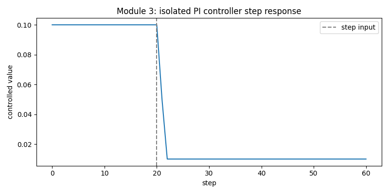
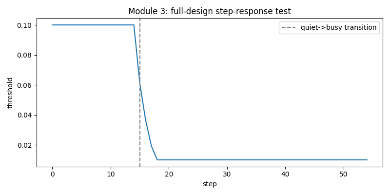
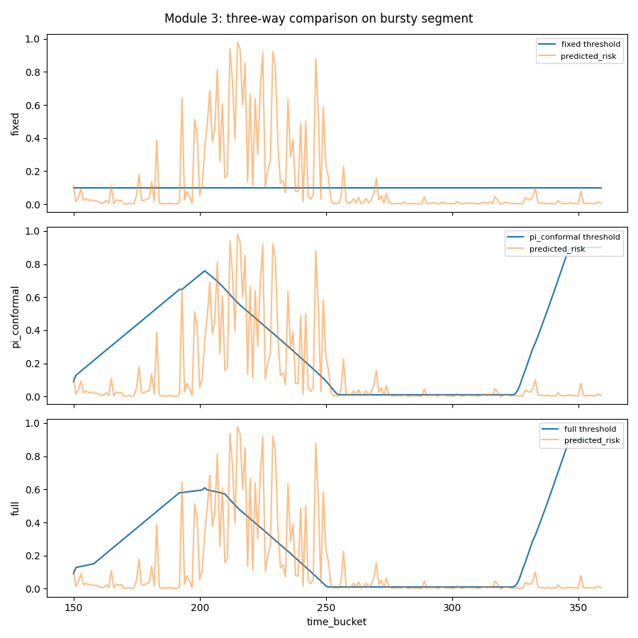
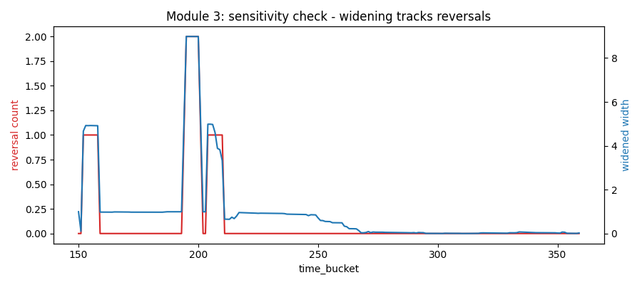
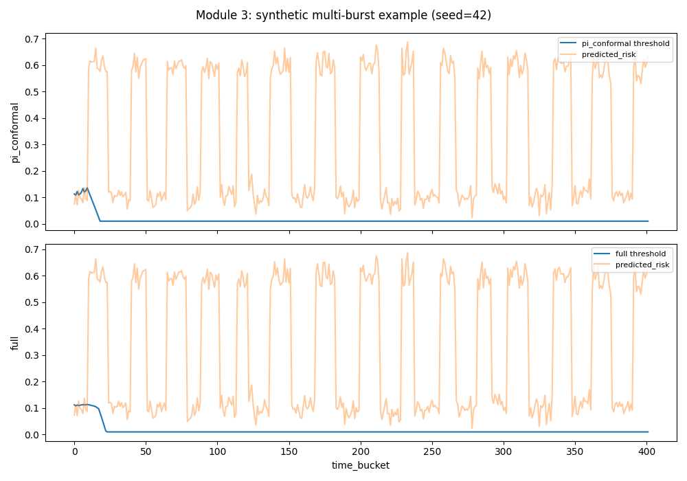

# Results & Statistics — Module 3 (Adaptive Control)

Every number and image below comes straight from `project/results/module3/` — no
recomputation. Each plot was opened and visually checked before writing its caption. See
`docs/Project_Files_Reference_MultiSignal_Autoscaling.md` §7 for what the code that produced
these actually does, including the ⭐ oscillation-conditioned widening individual contribution.

---

## 1. Isolated PI controller — hand-constructed step test

*What's plotted:* the controlled threshold value against a synthetic hand-built input,
isolated from the conformal-bounding layer entirely (plain `PIController`, no ACI, no
widening). **What it shows:** the threshold holds flat at 0.10 for the first 20 steps, then a
step change in the input at step 20 drives it down sharply, settling at 0.01 (the configured
lower bound) by step ~23 and staying there — a clean, bounded, monotonic response to a step
input, with no overshoot or oscillation. `responds_to_step: true`, `bounded: true`.

---

## 2. Adaptive Conformal Inference — coverage check

Real-data coverage on the held-out test set (90 rows, only 1 actual violation — see the Module
1 results file §1 for why this split is so imbalanced): **88.9% empirical coverage against a
90% target** — `close_to_target: true` (within the 15-percentage-point tolerance). With so few
positive examples in this split, this number should be read as "consistent with the target,"
not as a tight statistical confirmation of exact 90% coverage.

---

## 3. Full-design step-response test

*What's plotted:* the same kind of step test as §1, but through the complete design (PI +
conformal + oscillation widening) rather than the isolated controller, using a synthetic
quiet→busy transition. **What it shows:** the threshold holds at 0.10, then descends sharply at
the transition (step 15), settling at 0.01 within 2 steps and staying flat — `overshoot: 0.0`,
`settling_time_steps: 2`, `bounded: true`. The full design's step response looks essentially
identical in shape to the isolated controller's, confirming the conformal/widening layer
doesn't introduce instability of its own on a clean synthetic input.

---

## 4. The three-way comparison — real bursty segment (210 rows, 27 real violations)

*What's plotted:* three stacked panels sharing the same x-axis (time buckets 150–360, the
trace's bursty back half), each showing Module 1's real `predicted_risk` (orange) against one
of three threshold designs (blue): **fixed** (a flat 0.10, no adaptation at all), **pi_conformal**
(PI + plain ACI, no oscillation widening — isolates ⭐), and **full** (the complete design).
**What it shows:** the fixed threshold never moves, so the alert state (implicitly, whenever
orange crosses the flat blue line) is extremely noisy against the risk spikes clustered around
buckets 190–230. Both `pi_conformal` and `full` visibly climb during that same busy cluster
(peaking around 0.60–0.76 near bucket 200–210) before descending as risk quiets down, then
sharply climb again at the very end (buckets ~325+) as a new burst begins.

| | Fixed | PI + conformal only | Full design |
|---|---|---|---|
| Instability (reversals) | 0 | 4 | 4 |
| Deviation std | 0.000 | 0.294 | **0.277** |
| Over-provisioning timeshare | 20.95% | 21.90% | 24.29% |
| Under-provisioning timeshare | 8.57% | 11.43% | 11.43% |

**Disclosed finding: `pi_conformal` and `full` tie exactly on reversal count (4 vs. 4) on this
one real segment.** `pass_criteria.full_beats_pi_conformal_instability = false`. The file's own
interpretation, and the reason this isn't read as a negative result for the ⭐ contribution: 210
rows containing only one identifiable oscillation episode is too few events to statistically
resolve a difference between two designs that both react to the same underlying risk spikes —
not evidence the widening mechanism does nothing. Two things *do* support it even here: `full`'s
deviation std is lower than `pi_conformal`'s (0.277 vs. 0.294 — the threshold moves less
erratically even though it reverses direction the same number of times), and the sensitivity
check below directly confirms the widening mechanism is functioning as designed.

---

## 5. Sensitivity check — does widening actually track reversals?

*What's plotted:* reversal count (red, left axis) and the widened conformal interval width
(blue, right axis) over the same bursty segment, on twin axes. **What it shows:** the two series
move together almost exactly — every time the red reversal-count line steps up (around buckets
150–160, and much more sharply around 195–210 where it hits its max of 2), the blue widened-
width line spikes in near lock-step, reaching its maximum of ~8.98 right where reversals peak,
then both decay back toward zero together as the segment calms down after bucket ~270.

**Correlation between reversal count and widened width: r = 0.972.** `widens_after_reversal_
spike: true`. This is the direct mechanistic proof that the ⭐ individual contribution is
functioning exactly as designed — oscillation genuinely widens the safety margin, even though
§4's three-way comparison couldn't statistically separate its downstream effect on this small
real segment.

---

## 6. Synthetic addendum: multi-burst stress test (⭐ where the effect becomes statistically clear)

Design: 15 alternating quiet/busy synthetic segments per repeat, 50 repeats (seed=42 shown in
the plot), comparing `pi_conformal` against `full` directly.

*What's plotted:* two stacked panels, `pi_conformal` (top) and `full` (bottom), both against
the same synthetic predicted-risk series (orange) with its 15 repeating quiet→busy→quiet
cycles clearly visible as the regular sawtooth pattern. **What it shows:** in both panels the
threshold (blue) drops sharply at the very first burst (~step 20) and then stays pinned near
its lower bound (0.01) for the rest of the run, through all 15 subsequent bursts — visually, the
two panels look almost identical at this scale, which is exactly why the aggregate statistics
below (across all 50 repeats, not just this one seed) are what actually carries the finding.

| Metric | PI + conformal only | Full design | Mean difference | Wilcoxon p-value (one-sided) |
|---|---|---|---|---|
| Reversal count | 14.04 | **7.64** | 6.40 fewer | **9.8×10⁻⁶** |
| Deviation std | 0.02551 | 0.02392 | 0.00159 lower | 0.454 (not significant) |

**Reversal count: passes clearly.** `full_beats_pi_conformal_instability_synthetic = true` —
across 50 repeats, `full` never did worse than `pi_conformal` in 96% of runs (`full_never_
worse_rate: 0.96`), strictly better in 46%, and the one-sided Wilcoxon test is highly
significant (p ≈ 0.00001). **Deviation std: does not pass.** `full_beats_pi_conformal_
deviation_synthetic = false` — `full` is lower on average but the difference isn't consistent
enough across repeats to clear significance (p = 0.45), disclosed rather than omitted.

---

## 7. Pass criteria — summary

| Criterion | Result |
|---|---|
| PI controller responds to a step and stays bounded | ✅ Pass |
| Conformal coverage close to 90% target | ✅ Pass (88.9%, within tolerance) |
| Full-design step response bounded | ✅ Pass |
| `full` beats `pi_conformal` on instability, real bursty segment | ❌ Fail — exact tie, too few real events to resolve (§4) |
| Widening mechanism actually tracks reversal spikes | ✅ Pass — r = 0.972 (§5) |
| `full` beats `pi_conformal` on instability, synthetic (50 repeats) | ✅ Pass — p ≈ 0.00001 (§6) |
| `full` beats `pi_conformal` on deviation std, synthetic (50 repeats) | ❌ Fail — not significant, p = 0.45 (§6) |

Read together: the real-data three-way comparison alone is inconclusive on instability (too
small a sample), but the sensitivity check proves the mechanism itself works as designed, and
the synthetic addendum — built specifically to give the mechanism enough oscillation events to
be statistically resolvable — confirms it does reduce reversals, while being honest that it
doesn't also reduce deviation std by a statistically detectable amount.
